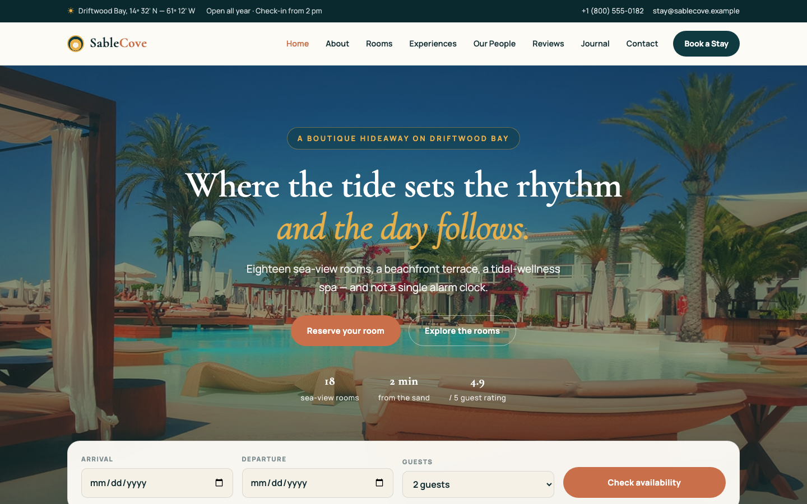

# Sable Cove — Boutique Coastal Hotel Template

A premium, framework-free HTML template for a boutique coastal hotel. Deep ocean teal grounds with warm sand surfaces, terracotta and gold accents, driven by Cormorant Garamond display type and Manrope body text — a calm, unhurried presence for a family-run hotel on Driftwood Bay.

## 📸 Screenshot

## Design System

| Token | Value |
|-------|-------|
| **Ground** | `--clr-cream` `#fdfbf6` (light), `--clr-sand` `#f6f1e7` (cream), `--clr-teal` `#0e3a40` (dark) |
| **Primary** | `--clr-teal` `#0e3a40` (ocean), `--clr-teal-deep` `#09292e` |
| **Accent** | `--clr-terra` `#c96f4a` (terracotta), `--clr-gold` `#e8b04b` |
| **Text** | `--clr-ink` `#102c31`, `--clr-text` `#54686c`, `--clr-text-soft` `#7d8d90` |
| **Display type** | `Cormorant Garamond` (serif, 400–700) |
| **Body type** | `Manrope` (sans, 400–800) |
| **Container** | 1200px max-width, centered |
| **Breakpoints** | ~992px (grid collapse), ~576px (single column) |

## Pages

| Page | File | Description |
|------|------|-------------|
| Home | [index.html](index.html) | Hero with crossfading bay views, check-in availability bar, rooms, experiences, testimonials, journal, CTA |
| About | [about.html](about.html) | Family story since 1987, stats band, Driftwood Bay split, value cards |
| Rooms | [room.html](room.html) | Six room cards, amenities dark section |
| Experiences | [service.html](service.html) | Eight experience cards, day-at-the-cove timeline |
| Our People | [team.html](team.html) | Four team member cards, crew dark split |
| Reviews | [testimonial.html](testimonial.html) | Six guest testimonials, guest-scoreboard stats |
| Journal | [blog.html](blog.html) | Six field notes and kitchen diaries |
| Contact | [contact.html](contact.html) | Contact form with `[data-form]` validation, info cards, map frame |
| Book | [booking.html](booking.html) | Booking form with date/room/guest selectors, terms |
| 404 | [404.html](404.html) | On-brand error page with recovery links |

## Features

- **Framework-free** — pure HTML5, CSS3 (custom properties, Grid, Flexbox, `clamp()`), vanilla JavaScript
- **Coastal editorial aesthetic** — ocean teal + sand + terracotta, serif display type, coastal hospitality vocabulary
- **Fluid responsive** — two breakpoints, no horizontal scroll on any viewport
- **Scroll reveal** — IntersectionObserver-powered `.reveal` animations (respects `prefers-reduced-motion`)
- **Mobile nav** — burger toggle with `aria-expanded` accessible pattern
- **Hero crossfade** — automatic 6s background image transition via `.hero-bg img` + `.active`
- **Check-in availability bar** — overlapping hero bottom with date/guest selectors and `[data-form]` validation
- **Room cards** — three-column layout with image, tag, pricing, facilities and book link
- **Experience cards** — icon-led tiles with dark and light variants
- **Timeline** — vertical dated list with gold dot markers
- **Team grid** — four-column member cards with role and bio
- **Testimonial cards** — avatar, star rating, italic quote
- **Blog grid** — post cards with category, image and teaser
- **Contact form** — `[data-form]` hook with `.form-ok` / `.form-err` / `.show` toggle
- **Newsletter** — footer sign-up form with validation feedback
- **Original imagery** — production hotel, room and coastal photography, no placeholders

## Tech Stack

- HTML5 + CSS3 (W3C-valid, semantic landmarks)
- Vanilla JavaScript (canonical IIFE build)
- Google Fonts (Cormorant Garamond + Manrope)
- SVG favicon (inline data: URI)

## SEO

- Semantic HTML5 structure (`<header>`, `<nav>`, `<main>`, `<section>`, `<footer>`)
- Unique `<title>` and `<meta description>` per page
- `lang="en"` attribute, `charset="utf-8"`, viewport meta
- Alt text on all images

## License

Free for personal and commercial use. Attribution appreciated but not required.

---

## Let's Build Something Together 🚀

[Book a free consultation](https://tally.so/r/q4q1L9)